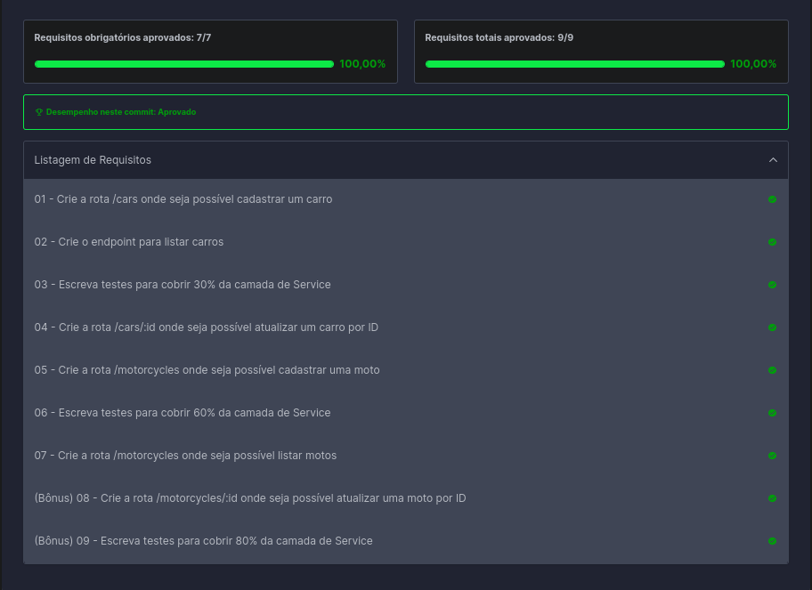

# Boas Vindas ao respositório do projeto car-shop

Para este projeto, foi aplicado os princípios de POO para a construção de uma API REST com CRUD para gerenciar uma concessionária e veículos utilizando o banco de dados MongoDB.

Foi utilizado uma arquitetura MSC e os principios POO, para facilitar a escabilidade e manutenção da aplicação.

 

## Habilidades

- Programação orientada a objetos (POO): Herança, Abstração, Encapsulamento e Polimorfismo;

- TypeScript: Classes, Instâncias, Atributos, Métodos e Objetos;

- Mongoose: ODM utilizado para conectar com o banco de dados;

- MongoDB: Banco de dados.

- Behavior Driven Development (BDD)

 

## Avaliação do projeto

 

### Requisitos baixar e rodar o projeto

É necessário ter o docker-compose instalado na versão 1.29 ou superior e que as portas 3001 e 27017, estejam desocupadas.

 

## Como rodar o projeto
 

1. Baixe o repositório utilizando o comando:
    
        git clone git@github.com:nobregasylvio/car-shop.git

2. Entre na pasta do projeto

        cd car-shop

3. Inicie o node e o db com o comando:

        docker-compose up -d

4. Entre no container node com o comando:        

        docker exec -it car_shop bash

5. Instale as dependências:

        npm install

6. Rode o projeto:

        npm start
